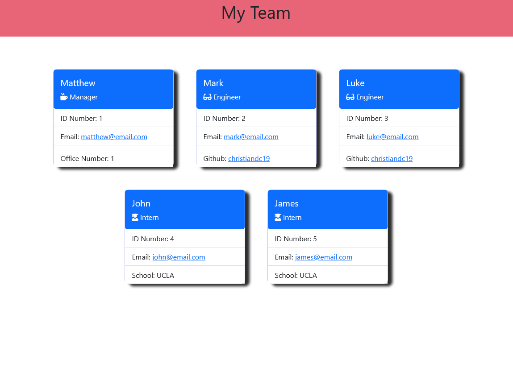

  ## 
  # Team Profile Generator
  ## To build a Node.js command-line application that takes in information about employees on a software engineering team and generates an HTML webpage that displays summaries for each person. 

  ------------------
  ## TECHNOLOGIES USED
  ### Node.js
  ### Bootstrap
  ### Html
  ### CSS
  ### Fontawesome
  ------------------

  ------------------
  ## INSTALLATION
  ### You must install the following for this app to function:
  ### Dependencies: 
  ### inquirer
  ### express
  ### jest
  ------------------
  ## LICENSE  
  ### https://opensource.org/licenses/MIT
  ------------------
  ## TEST  
  ### Jest
  ------------------
  ## DEPLOYMENT  
  ### https://christiandc19.github.io/team-profile-generator/
  ### https://github.com/christiandc19/team-profile-generator/
  ### https://bootcampspot.instructuremedia.com/lti/launch?custom_arc_launch_type=embed&custom_arc_media_id=9bad8ff3-d9e3-4bf4-8770-3689822eac25-2178
  ------------------
  ## QUESTIONS  
  ### If you have any questions, you may contact me at:
  ### Github: https://github.com/christiandc19 or,
  ### christiandc19@hotmail.com
